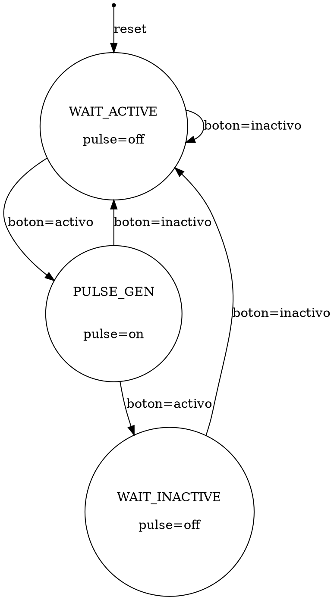

# Ejemplo_TDD_2_22
Ejemplo de repositorio para TDD segundo semestre 2022.
Funciona para VIVADO 2019.1 usando complemento desde:
https://github.com/barbedo/vivado-git/tree/72579aea69e26a1786cb1b3ef794050f0c21d468

## 1. Abreviaturas y definiciones
- **FPGA**: Field Programmable Gate Arrays

## 2. Referencias
[0] David Harris y Sarah Harris. *Digital Design and Computer Architecture. RISC-V Edition.* Morgan Kaufmann, 2022. ISBN: 978-0-12-820064-3

## 3. Desarrollo

### 3.1 Package "pkg_fsm_pulsos"

Este archivo incluye las definiciones para el funcionamiento del sistema. La lista completa:

#### Tipos de variables
- `t_slope`: Se utiliza para definir el flanco que se detecta, tiene dos miembros: POS_EDGE y NEG_EDGE.

#### Constantes
- `DETECTED_SLOPE`: Define el flanco que se detecta para disparar el pulso. 
- `OUT_POLARITY`  : Define el valor activo de la salida del pulso.

### 3.1 Módulo "fsm_pulsos"

El módulo *fsm_pulsos* genera un pulso de salida en `1` de un ciclo de reloj de ancho luego de recibir un flanco positivo en la entrada `button_i`SystemVerilog. La FSM fue implementada siguiendo la estructura Moore. La señal de entrada es `button_i`, el flanco detectado está dado por `DETECTED_SLOPE` en el package `pkg_fsm_pulsos`

#### 1. Encabezado del módulo
```SystemVerilog
module fsm_pulsos(
    input logic     clk_i,      
    input logic     rst_n_i,    // Reset input - active low
    input logic     button_i,   // Button input
    output logic    pulse_o     // Pulse output 
    );
```
#### 2. Parámetros

El módulo no posee parámetros. 

- `clk_i`: Entrada de reloj del módulo
- `rst_n_i`: Entrada de reset del módulo, activo en **bajo**.
- `button_i`: Entrada del flanco a detectar.
- `pulse_o`: Salida del módulo. Presenta un pulso con nivel `OUT_POLARITY` por un ciclo de reloj cuando se detecta el flanco dado por `DETECTED_SLOPE`.

#### 4. Criterios de diseño

Se seleccionó una arquitectura moore para la máquina de estados y el diagrama de estados es:


la implementación se hizo en tres bloques always: uno para la variable de estado, uno para la decodificación de siguiente estado y otro para la generación de la salida. 

En esta máquina la salida **NO** está registrada.

#### 5. Testbench

El testbench de la FSM está en `fsm_pulsos_tb.sv`. En este testbench se genera una instancia de la máquina de estados y se generan entradas de ancho aleatorio. Además al final de la prueba se generan entradas de un ciclo de reloj de ancho separadas por un ciclo de reloj (una de las esquinas de prueba).

La prueba es auto-verificable e indica cuando la salida del módulo no cumple con un ancho de un ciclo de reloj (ya sea porque no se genera una salida o que se excede de un ciclo de reloj) cada vez que se detecta el flanco a buscar.

El testbench hace uso del archivo `pkg_fsm_pulsos` que define el flanco que se busca y el valor activo esperado en la salida. 

Las pruebas que se muestran a continuación corresponden a una simulacion post-implementación, usando `DETECTED_SLOPE=POS_EDGE` y `OUT_POLARITY=1`.

En la simulación post-implementación, se observa un valor indefinido en la salida por aproximadamente 5~ns, el cual desaparece dado que se está aplicando el reset:


Luego de la etapa de reset, se aplican varios pulsos de longitud variable y se observa que el sistema responde con un pulso activo luego de detectar el flanco positivo en la entrada. La respuesta se da un ciclo de reloj después de dicho flanco. 


El pulso de salida dura un ciclo de reloj, sin importar la longitud del nivel activo de la entrada.


Además, se observa que el circuito logra responder también ante entradas que activas por un ciclo de reloj e inactivas por otro ciclo de reloj.


En todas las pruebas se muestra que el circuito cumple con las especificaciones. Salida en la terminal luego de la prueba:
```
196000 OK   : pulse lasted           1 clks
296000 OK   : pulse lasted           1 clks
486000 OK   : pulse lasted           1 clks
666000 OK   : pulse lasted           1 clks
796000 OK   : pulse lasted           1 clks
866000 OK   : pulse lasted           1 clks
896000 OK   : pulse lasted           1 clks
916000 OK   : pulse lasted           1 clks
```


### 3.2 Módulo "sync_inputs"

Este modulo se utiliza para sincronizar las entradas con el reloj del sistema.

#### 1. Encabezado del módulo
```SystemVerilog
module sync_inputs
    #(
        parameter DELAY = 3
    )(
        input logic  clk_i,
        input logic  pin_i,
        output logic pin_o
    );
```
#### 2. Parámetros

- `DELAY`: Define la cantidad de etapas en el circuito. También es la cantidad de ciclos de reloj que se atrasa esta señal.

#### 3. Entradas y salidas:

- `clk_i`: Entrada de reloj.
- `pin_i`: Entrada de la señal a sincronizar.
- `pin_o`: Salida sincronizada.

#### 4. Criterios de diseño
La metastabilidad es un problema que se puede dar cuando las entradas no están sincronizadas con el reloj del sistema. Cómo se observa en la figura, si la señal viola los tiempos de hold o setup, la salida del flip-flop no es estable. 


Sin embargo, se puede hacer uso de una cadena de flip-flops para "filtrar" la metastabilidad. Este módulo crea una cadena de `DELAY` flip-flops para sincronizar la señal con el reloj del sistema. Por defecto `DELAY=3`.

#### 5. Testbench
No se ha diseñado un testbench para este bloque.


### 3.3 Módulo "top_pulsos"

Es el módulo *TOP* del sistema. Se hace instancia a los sincronizadores de los pines de entrada y a la FSM generadora de pulsos. 

#### 1. Encabezado del módulo
```SystemVerilog
module top_pulsos(
        input  logic clk_pi,        // Clock input port
        input  logic rst_n_pi,      // Reset input port - active low        
        input  logic button_pi,     // Button input port
        output logic led_po         // Led output port
    );
```

#### 2. Parámetros

Este módulo no posee parametros. 

#### 3. Entradas y salidas:

- `clk_pi`: Es la entrada de reloj del sistema.
- `rst_n_pi`: Es la entrada de reset del sistema.
- `button_pi`: Entrada lógica proveniente de un botón externo. La entrada es activa según el parametro `DETECTED_SLOPE` en el `pkg_top_pulsos`.
- `led_po`: Salida que se conecta a un LED. Salida activa en alto.

#### 4. Criterios de diseño

El módulo se basa en el siguiente diagrama de bloques.


Según se observa, la entrada a este bloque es un botón externo a la FPGA. La señal generada se hace pasar por un bloque sincronizador. Una vez que se tiene una señal sincronizada, esta llega a la `fsm_pulsos`, la cual se encarga de detectar el flanco `DETECTED_SLOPE`. La salida que corresponde a un pulso de un ciclo de reloj con nivel `OUT_POLARITY` se dá una sola vez aunque el nivel de la entrada se mantenga. La figura muestra el comportamiento esperado del sistema:


#### 4. Criterios de diseño

a. Se definieron los parametros `DETECTED_SLOPE` y `OUT_POLARITY` para permitir que el sistema pueda adaptarse a diferentes requerimientos aparte del mostrado en la figura anterior. 

b. Se diseñó y comprobó el bloque `fsm_pulsos`. El diseño de este se mostró en ["fsm_pulsos"](#31-m%C3%B3dulo-fsm_pulsos)).

#### 5. Constraints

Los pines asignados son:

| Señal         | Pin   | En tarjeta  |
| ------------- |:-----:| -----------:|
| clk_pi        | E3    | CLK         |
| rst_pi        | E16   | BTNC        |
| button_pi     | F15   | BTNU        |
| led_po        | T8    | LED0        |


Se definieron las siguientes constraints:

```sdc
set_property PACKAGE_PIN E3 [get_ports clk_pi]							
	set_property IOSTANDARD LVCMOS33 [get_ports clk_pi]
	create_clock -add -name sys_clk_pin -period 10.00 -waveform {0 5} [get_ports clk_pi]

set_property PACKAGE_PIN T8 [get_ports {led_po}]					
	set_property IOSTANDARD LVCMOS33 [get_ports {led_po}]
	
set_property PACKAGE_PIN E16 [get_ports rst_n_pi]						
	set_property IOSTANDARD LVCMOS33 [get_ports rst_n_pi]

set_property PACKAGE_PIN F15 [get_ports button_pi]						
	set_property IOSTANDARD LVCMOS33 [get_ports button_pi]
````

#### 5. Testbench

No se ha generado un test-bench para este módulo

### 3.4 Módulo "generico"
#### 1. Encabezado del módulo
#### 2. Parámetros
#### 3. Entradas y salidas:
#### 4. Criterios de diseño
#### 5. Testbench

## Apendices:
### Diagrama de estados:
**este diagrama se generó usando graphviz**



### Diagrama de tiempos del TOP:

**Este diagrama se hizo en wavedrom**
```wavedrom
{signal: [
  {name: 'clk',    wave: 'p.....|..|.....'},
  {name: 'button',  wave: '0.1...|0.|.1...',
   				   node: '..a........c...'},
  {name: 'LED', wave: '0..10.|..|..10.',
   				   node: '...b........d..'},
  
],

 edge:['a~>b genera',
'c~>d genera',
]
}

```
